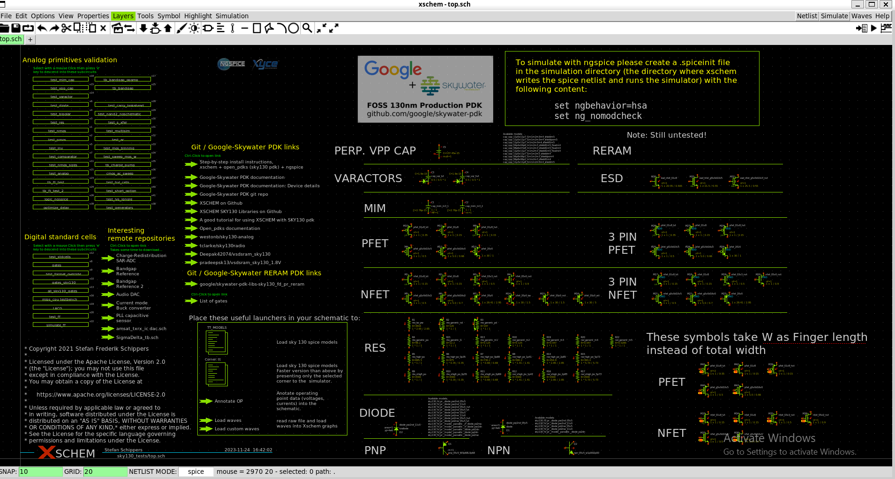

# Installation-of-open-source-analog-design-tools-with-sky130-PDK
 Analog design tools - 1) Xschem , 2) Gaw , 3) Ngspice , 4) Magic , 5) Klayout . Follow this repository to install all the necessary tools for analog VLSI designing.

## Contents  
- [1. Tools and PDK Setup](#1-Tools-and-PDK-setup)  
  - [1.1 Tools Setup](#11-Tools-setup)
  - [1.2 PDK Setup](#12-PDK-setup)  

##1. Tools and PDK Setup  
###1.1 Tools Setup  
For our _analog design_, we need to install some tools. Here we will use -  
- [Xschem](http://repo.hu/projects/xschem/) [**For circuit design** ]  
- [Ngspice](http://ngspice.sourceforge.net/) [ **Spice simulator** ]  
- [Gaw](http://gaw.tuxfamily.org) [**Waveform viewer,though it's optiona**l ]  
- [Magic](http://opencircuitdesign.com/magic/) [ **Layout designing tool** ]  
- [Klayout](https://www.klayout.de/build.html) [**Layout designing tool, though it's optional** ]  
- [Netgen](http://opencircuitdesign.com/netgen/) [ **Layout vs schematic check (LVS) tool** ]  

_**EDA tools and pdks require these for correct installation.  
JUST COPY AND PASTE THE FOLLWING COMMAND PROPERLY.**_  
```  
sudo apt-get install m4 tcsh csh libx11-dev libx11-xcb-dev tcl-dev tcllib swig vim-gtk tk-dev libcairo2-dev mesa-common-dev libglu1-mesa-dev libncurses-dev build-essential clang bison flex libreadline-dev gawk libffi-dev git graphviz xdot pkg-config python3 libboost-system-dev vim adms autoconf automake libtool libxpm-dev libxaw7-dev libssl-dev libgtk-3-dev libboost-python dev libboost-filesystem-dev zlib1g-dev xterm graphicsmagick ghostscript --assume-yes  
```
This process will take some time. So, keep patience until all the libraries and packages are not installed properly. 
  
###Installation structure:-  
- Open-source *EDA tools* and *PDK* works with **Linux OS** only. So user must install ubuntu (any version) in his/her PC.
- Just copy and paste the following commands in ubuntu terminal one after another. 
   - **Update Ubuntu Packages** :-  
     ```  
      sudo apt-get update  
      sudo apt-get install build-essential gcc make perl dkms
     ```  
   - **Install Git on Ubuntu** (If you have this, please ignore the step):-  
     ```  
     sudo apt install git  
     ```   
   - Give the **Sudo** password -  
     ```  
     [sudo] password for user:   
     ```  
   - **Check if git installed:-**  
     ```
      git --version  
     ```
   - **Create new directory 'design' and sub-directories 'tools' and 'pdks':-**  
     - Create this directory in **/home** directory  location.  
       ```  
       mkdir open_source   
       ```  
     - Entering into the **open_source** directory -  
       ```  
       cd design  
       ```
     - Creating two directories named as **tools** & **pdk**   
       ```  
       mkdir tools pdk  
       ```  
###Xschem installation:-  
  

[Xschem](http://repo.hu/projects/xschem/xschem_man/xschem_man.html) is a **schematic capture program** that allows to interactively enter an electronic circuit using a graphical and easy to use interface. When the schematic has been created a circuit netlist can be generated for simulation.
####Installation of Xschem :-
- Change directory to tools, which is the sub-folder of **open_source**  
  ```  
  cd  ~/open_source/tools   
  ```  
 - **Download xschem from github:-**  
   ```  
   git clone https://github.com/StefanSchippers/xschem.git   
   ```
 - **Xschem** binaries will be inside this *xschem* folder  
   ```  
   cd xschem  
   ```  
 - **Install xschem:-**  
   ```  
   ./configure   
   make 
   sudo make install  
   ```  
 - Run **xschem** command to **check** tool invoking:-	
   ```  
   xschem	
   ```    
 - If xschem has been installed properly, you will see xschem window as following. Till now **sky130 pdk** has not been integrated with xschem.

   

###Ngspice  


[Ngspice](http://ngspice.sourceforge.net/devel.html) is the open source spice simulator for electric and electronic circuits. Ngspice is an open project, there is no closed group of developers.

[Ngspice Reference Manual](http://ngspice.sourceforge.net/docs/ngspice-manual.pdf): Complete reference manual.

####Ngspice installation steps :- 
- Migrate to the tools installation root directory.  
  ```  
  cd ~/open_source/tools  
  ```  
 - **Download ngspice from github:-**  
   ```  
   git clone https://git.code.sf.net/p/ngspice/ngspice ngspice_git  
   ```   
 - Ngspice binary has been dowloaded. Move to the given directory.  
   ```  
   cd ngspice_git  
   ```  
 - **Install ngspice:-**  
   ```  
   ./autogen.sh --adms  
   mkdir release  
   cd release  
   ./configure --with-x --enable-xspice --disable-debug --enable-cider --with-readline=yes --enable-openmp	
   make -j4  
   sudo make install  
   ```   
 - **VERIFY NGspice installation :-**  
   If ngspice has been installed properly it will show as following in terminal. NGspice is **command line interface (CLI)** , so that you can’t see any GUI window.  
   Type the following command -  
   ```
   ngspice  
   ```  
     

###GAW Installation
 - **GAW** is used to display output waveforms from xschem simulation.  
 - Migrate to the tools installation root directory.  
   ```  
   cd ~/open_source/tools   
   ```  
 - Copy the download link of zip file of gaw.  
   ``` 
   wget http://download.tuxfamily.org/gaw/download/gaw3-20220315.tar.gz   
   tar -xvzf gaw3-20220315.tar.gz  
   cd gaw3-20220315	 
   ./configure  
   make -j$(nproc)  
   sudo make install	
   ```  
 - To check the installation has been properly done yet or not, type the following command - 
   ```  
   gaw   
   ```  
###Magic Installation


 [Magic](http://opencircuitdesign.com/magic/) is a VLSI **layout tool**. 

 - **Magic download**- 
    ```  
    cd ~/open_source/tools
    git clone https://github.com/RTimothyEdwards/magic
    ```  
 - **Magic installation**-  
   ```
   cd magic  
   ./configure
   make  
   sudo make install
   ```  
 - **Verify the installation of magic** :-  
   Run **magic** command to invoke tool
   ```  
   magic & 
   ```  
     

###Netgen Installation


[Netgen](http://opencircuitdesign.com/netgen/) is a tool for comparing netlists, a process known as **LVS**, which stands for "**Layout vs. Schematic**". This is an important step in the integrated circuit design flow, ensuring that the geometry that has been laid out matches the expected circuit.

 - Move to the root directory of tool installation.
  ```
  cd ~/open_source/tools
  ```
 - **Download netgen from github**:-  
   ```  
   git clone https://github.com/RTimothyEdwards/netgen
   cd netgen/
   ```  
 - **Install netgen**:- 
   ```  
   ./configure  
   make
   sudo make install
   ```

###1.2 PDK Setup  
 - A **process design kit (PDK)** is a set of files used within the semiconductor industry to model a fabrication process for the design tools used to design an integrated circuit. The PDK is created by the foundry defining a certain technology variation for their processes. It is then passed to their customers to use in the design process.

 - **SKY 130 PROCESS DESIGN KIT (PDK)** is the open-source chip manufacturing program based on **Skywater’s 130nm CMOS technology**.	
 - The PDK we are going to use for this BGR is _**Google Skywater-130 (130 nm) PDK**_.

 - Install **Open_Pdks** that will provide among other things all the sky130 PDK data, including standard cells, SPICE models, layout data, timing information, design rules and provides also also the Xschem symbols of available silicon primitive devices and the set of logic standard cells built on top of these primitive devices.
 - Please ensure sufficient disk space is available (**Open_pdks** uses several GB, a lot of space can be recovered after installation by removing the source files if needed). Also keep in mind that the installation takes considerable time.  
 
 #### Sky 130 PDK Installation  
 - Change directory to **pdk** which has been created earlier.  
   ```  
   cd ~/open_source/pdk	
   ```  
 - **Download pdk from github** :-	
   ```  
   git clone git://opencircuitdesign.com/open_pdks	
   cd open_pdks  
   ```  
 - For installing only analog PDK run this command. Less time and disk space for download.  
 - **Copy the following command in the terminal** -  
   ```  
   ./configure --enable-sky130-pdk --enable-sram-sky130 --disable-sc-hs-sky130 --disable-sc-ms sky130 --disable-sc-ls_x0002_sky130 --disable-sc-lp-sky130 --disable-sc-hd-sky130 --disable-sc-hdll-sky130 --disable-sc-hvl-sky130	
   ```  
 - This process may take **1hr - 2hrs** or more according to your internet speed. 
   ```  
   make  
   sudo make install 
   make veryclean	  
   ```  
 #### STRUCTURE AND LOCATION OF INSTALLED PDK**:-  
 - At this point the complete PDK has been installed in _**/usr/local/share/pdk**_. To check the PDKs have been installed or not, migrate to the location (_**/usr/local/share/pdk**_) using ubuntu GUI or Commands. Using command Line Interface:- 
   ```  
   cd  /  
   cd /usr/local/share/pdk  
   ```  
 - You can check there will will be **two PDK variants** -
   1)  **sky130A** 	
   2)  **sky130B**  

#### Project directory setup:-
 - Create a new project directory in **$HOME** where circuit design will be done.	
   ```  
   mkdir design   
   ```  
 - Create directories for running individual tools:-  	 
   ``` 
   cd design
   mkdir xschem magic netgen  
   ```  
 #### Xschem setup:- 
 - Setup for running xschem and ngspice with sky130 pdk. 
 - **N.B - Please carefully follow these steps and do the same which has been shown here. If  any mistake occured during this set-up process, either Xschem or NGspice will show you error.**  
 - Change the directory to _**xschem**_ which has been created earlier.
   ```  
   cd xschem	
   ln -s /usr/local/share/pdk/sky130A/libs.tech/xschem/xschemrc	  
   ln -s /usr/local/share/pdk/sky130A/libs.tech/ngspice/spinit .spiceinit      
   ```  
 - Write this command to check wheather the path has been linked properly or not.You will see the lines in the terminal which has been shown in the following diagram if PDK path and NGspice path has been properly linked with xschem.  
   ```  
   ll  
   ```  
     
 - **XSCHEM integrated with sky130 PDK**  
   - Run '**xschem**' on terminal and will get xschem main page showing sky130 devices. 
   - Always invoke xschem from this directory as the .xschemrc and .spiceinit files are present at this folder.
   - You can see the top schematic page which has been shown in the following diagram if you followed all the steps properly. Congratulations, now xschem is fully integrated with sky130 PDK. 
   - Invoke xschem from terminal.  
     ``` 
     xschem &  
     ```  
  

#### MAGIC setup for SKY130 PDK INTEGRATION
 - Do setup for running magic with sky130 pdk.
   ```  
   cd ~/design/magic
   ln -s /usr/local/share/pdk/sky130A/libs.tech/magic/sky130A.magicrc .magicrc
   ```  
 - **Verify the installation of MAGIC (With PDK integration)**
    - Run '**magic'** on terminal and magic window will open with **sky130A** technology shown integrated in window. (Always invoke magic from the **/home/design/magic** location to access pdk libraries).  

  

#### Netgen setup with pdk integration 
 - Do setup for netgen with sky130 pdk
   ```  
   cd ~/design/netgen
   ln -s /usr/local/share/pdk/sky130A/libs.tech/netgen/setup.tcl setup.tcl
   ```  
 - **Verify the installation of netgen (With PDK integration)**  
   - Run **'netgen'** on terminal, netgen window will open,
     ``` 
     netgen  
     ```  

  

#### KLayout Installation   
``` 
cd ~/open_source/tools/  
mkdir klayout
cd klayout
```  
 - Install package dependencies required for klayout
  ```  
  sudo apt install gcc g++ make qtbase5-dev qttools5-dev libqt5xmlpatterns5-dev qtmultimedia5-dev
  libqt5multimediawidgets5 libqt5svg5-dev ruby ruby-dev python3 python3-dev libz-dev
  ```
 - Download Klayout binaries from following link through browser in following location:   
   ```  
   ~/open_source/tools/klayout
   ```  
   ``` 
   https://www.klayout.org/downloads/Ubuntu-22/klayout_0.28.11-1_amd64.deb
   ```  
 - Follow these steps to install klayout
   ```  
   sudo dpkg -i klayout_0.28.11-1_amd64.deb
   sudo apt-get install –f
   ```  
 - **Klayout setup for SKY130 PDK INTEGRAION**  
    - Do setup for klayout with sky130 pdk
    - Open a new terminal
      ```  
      cd ~/design/klayout
      ```  
    - Link sky130 klayout technology files to project directory
      ```  
      ln -s /usr/local/share/pdk/sky130A/libs.tech/klayout/tech/sky130A.lyt sky130A.lyt
      ```
    - **Verify the installation of netgen (With PDK integration)**  
      ```  
      klayout 
      ```  


   
                        
                        
                            >   THANK YOU


 


